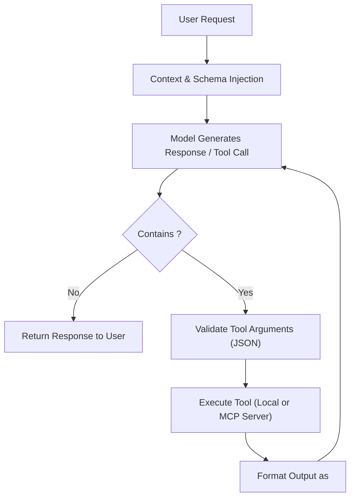

# Agent Architecture & Tool Orchestration (`docs/AGENT_ARCHITECTURE.md`)

*Authoritative Source: [`src/serving/workspace.py`](../src/serving/workspace.py), [`src/mcp/client.py`](../src/mcp/client.py), [`src/inference/rag.py`](../src/inference/rag.py)*

---

## 1. Agent Execution Loop

The agent loop enables multi-turn autonomous problem-solving through iterative reasoning and environment interaction:

---

## 2. Model Context Protocol (MCP) Integration

[`src/mcp/client.py`](../src/mcp/client.py) implements a lightweight, robust client for the Model Context Protocol:
- Connects to external MCP servers via JSON-RPC 2.0 over standard input/output (`stdio`) or SSE.
- Discovers available tool declarations dynamically (`tools/list`).
- Translates MCP tool schemas into system prompt function definitions.
- Dispatches executions (`tools/call`) and injects outputs back into the conversation.

---

## 3. Local Workspace Tools

[`src/serving/workspace.py`](../src/serving/workspace.py) and [`src/inference/local_tools.py`](../src/inference/local_tools.py) provide built-in sandboxed tools:
- `workspace_read_file`: Reads files strictly within the workspace directory boundary.
- `workspace_search`: Regex search across files with path restriction.
- `workspace_edit_file`: Applies verified patches with hash-based conflict detection.

All commands enforce strict path confinement to prevent directory traversal outside the configured repository boundary.

---

## 4. Retrieval-Augmented Generation (RAG)

[`src/inference/rag.py`](../src/inference/rag.py) indexes local documents (PDF, Markdown, TXT, JSON) into a SQLite vector store (`data/rag/index.sqlite`):
1. **Document Ingestion**: Chunks documents into overlapping windows (default 256 tokens).
2. **Dense Vector Search**: Compares query embeddings against document chunk embeddings using cosine similarity.
3. **Context Augmentation**: Formats the top-$K$ retrieved snippets into the prompt with file references and confidence scores.

