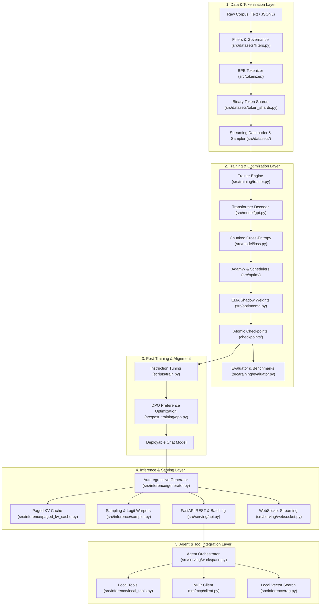

# System Architecture (`docs/ARCHITECTURE.md`)

This document details the layered architectural structure of `llm-engine`, illustrating the data flow, boundary contracts, and relationships between subsystems.

---

## 1. High-Level Architecture Diagram

---

## 2. Architectural Subsystem Layers

### Layer 1: Data & Tokenization
- **Purpose**: Transform unbounded raw text corpora into fixed-length, memory-mapped token shards with rigorous governance checks (PII, toxicity, deduplication).
- **Core Modules**: `src/datasets/`, `src/tokenizer/`.
- **Interface**: The data layer produces batched dictionaries containing `input_ids`, `labels`, and attention masks.

### Layer 2: Model Architecture
- **Purpose**: Pure PyTorch tensor compute engine implementing the causal decoder Transformer.
- **Core Modules**: `src/model/` (Attention, Transformer Block, RoPE, RMSNorm, SwiGLU, Embedding).
- **Interface**: Receives `input_ids [batch, seq_len]`, produces `logits [batch, seq_len, vocab_size]` or hidden states.

### Layer 3: Optimization & Training
- **Purpose**: Manages forward-backward passes, mixed-precision scaling, gradient accumulation, learning rate schedules, EMA shadow weights, and atomic disk checkpoints.
- **Core Modules**: `src/training/`, `src/optim/`.
- **Interface**: Orchestrates checkpoint serialization (`latest.pt`, `best.pt`) with full RNG state and optimizer state.

### Layer 4: Post-Training & Alignment
- **Purpose**: Supervised fine-tuning on multi-turn dialogues and Direct Preference Optimization (DPO) on paired responses.
- **Core Modules**: `src/post_training/`.
- **Interface**: Aligns raw pre-trained logit distributions with human preferences and conversational turn formats.

### Layer 5: Inference Runtime & Serving
- **Purpose**: High-throughput autoregressive generation with Paged KV memory management, dynamic batch queues, and token streaming.
- **Core Modules**: `src/inference/`, `src/serving/`.
- **Interface**: Exposes HTTP POST `/v1/chat/completions` and full-duplex WebSocket `/ws/generate`.

### Layer 6: Agent & Tool Orchestration
- **Purpose**: Allows the model to interact with the environment via structured tool calls, MCP protocol servers, and local vector retrieval.
- **Core Modules**: `src/mcp/`, `src/inference/local_tools.py`, `src/inference/rag.py`.
- **Interface**: Standard JSON tool-calling schema parsing and result injection.

