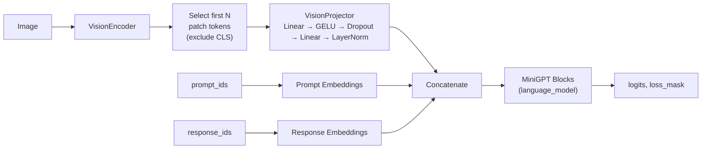
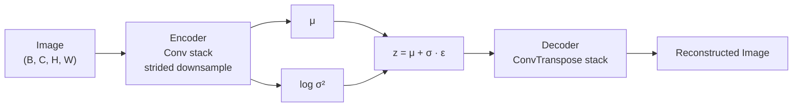

# Vision, Multimodal & Diffusion Systems (`VISION.md`)

Documentation for the image-oriented subsystems that extend the core LLM engine
with visual understanding, multimodal reasoning, and image generation capabilities.

---

## Table of Contents

1. [Overview](#overview)
2. [Vision Encoder](#vision-encoder)
3. [Image Classification](#image-classification)
4. [Multimodal Vision-Language Model](#multimodal-vision-language-model)
5. [Diffusion Models](#diffusion-models)
6. [Latent Diffusion](#latent-diffusion)
7. [Image Data Pipeline](#image-data-pipeline)
8. [Configuration Reference](#configuration-reference)
9. [Test Coverage](#test-coverage)

---

## Overview

The core LLM engine handles text generation via the MiniGPT transformer. The
subsystems documented here add three families of visual capability on top of that
foundation:

| Subsystem | Directory | Purpose |
|---|---|---|
| **Vision** | `src/vision/` | Encode images into token sequences (ViT) and classify them |
| **Multimodal** | `src/multimodal/` | Bridge vision encodings into the LLM embedding space for joint vision-language modelling |
| **Diffusion** | `src/diffusion/` | Generate images via DDPM / DDIM denoising with optional latent-space VAE |
| **Image Data** | `src/image_data/` | Load, preprocess, augment, and audit image datasets without a torchvision dependency |

All four subsystems follow the same conventions as the rest of the engine:
YAML-driven `from_config()` class methods, deterministic tests, and no
heavyweight external dependencies beyond PyTorch and Pillow.

---

## Vision Encoder

Source files:
[patch_embedding.py](../src/vision/patch_embedding.py) ·
[encoder.py](../src/vision/encoder.py)

### Patch Embedding

[`PatchEmbedding`](../src/vision/patch_embedding.py)
converts a batch of images into a sequence of patch tokens using a single
non-overlapping `Conv2d` projection.

**Parameters:**

| Parameter | Description |
|---|---|
| `image_size` | Expected spatial resolution (square) |
| `patch_size` | Side length of each non-overlapping patch |
| `channels` | Number of input channels (typically 3) |
| `hidden_size` | Embedding dimension per patch token |
| `strict_image_size` | If `True`, reject inputs that do not match `image_size` exactly |

**Geometry:**

```
num_patches = (image_size / patch_size)²
```

A Conv2d with `kernel_size=patch_size` and `stride=patch_size` maps each patch
to a `hidden_size`-dimensional vector. The output is reshaped to:

```
[batch, num_patches, hidden_size]
```

**Validation rules:**

- Input must be a 4-D tensor `[B, C, H, W]`.
- Input dtype must be floating-point.
- `image_size` must be evenly divisible by `patch_size`.

### Vision Transformer (VisionEncoder)

[`VisionEncoder`](../src/vision/encoder.py)
assembles a full Vision Transformer from the components above.

```
Image → PatchEmbedding → [CLS] ⊕ patch_tokens → + pos_embed → N × VisionBlock → LayerNorm
```

**Default configuration:**

| Field | Default |
|---|---|
| `image_size` | 128 |
| `patch_size` | 16 |
| `channels` | 3 |
| `hidden_size` | 192 |
| `layers` | 4 |
| `heads` | 3 |
| `ffn_hidden_size` | 768 |

**Key methods:**

| Method | Returns | Shape |
|---|---|---|
| `forward(images)` | Full encoded sequence including CLS token | `[batch, 1 + num_patches, hidden_size]` |
| `pooled(images)` | Pooled representation (CLS token or mean pooling) | `[batch, hidden_size]` |
| `from_config(config)` | New instance from a YAML config dict | — |

**Position embedding interpolation:** When the input image size differs from the
size the model was initialised with, positional embeddings are resized via
bicubic interpolation so the encoder can handle variable resolutions at
inference time.

### VisionBlock

[`VisionBlock`](../src/vision/encoder.py)
implements a single ViT transformer layer with **pre-norm** residual
connections:

```
x  ──→ LayerNorm → MultiheadAttention ──→ + ──→ LayerNorm → FFN(GELU) ──→ + ──→
   └──────────────────────────────────────┘  └──────────────────────────────┘
```

Dropout is configurable and applied after both the attention and FFN stages.

---

## Image Classification

Source file:
[classifier.py](../src/vision/classifier.py)

[`VisionClassifier`](../src/vision/classifier.py)
adds a lightweight classification head on top of `VisionEncoder`:

```
Image → VisionEncoder.pooled() → Dropout → Linear(hidden_size, num_classes) → logits
```

- Requires **≥ 2 classes**.
- Instantiable via `from_config(config)`.

---

## Multimodal Vision-Language Model

Source files:
[projector.py](../src/multimodal/projector.py) ·
[model.py](../src/multimodal/model.py)

### Architecture



### VisionProjector

[`VisionProjector`](../src/multimodal/projector.py)
maps visual features into the LLM embedding space with a two-layer MLP:

```
Linear(vision_hidden → language_hidden) → GELU → Dropout → Linear → LayerNorm
```

Input: `[batch, tokens, vision_hidden]` → Output: `[batch, tokens, language_hidden]`

### VisionLanguageModel

[`VisionLanguageModel`](../src/multimodal/model.py)
is a **non-invasive wrapper** that connects a `VisionEncoder` to a `MiniGPT`
language model without modifying the text model's checkpoint layout.

**Constructor arguments:**

| Argument | Description |
|---|---|
| `vision_encoder` | A `VisionEncoder` instance |
| `language_model` | A `MiniGPT` instance |
| `visual_tokens` | Number of patch tokens to keep per image |
| freeze flags | Control whether vision/language backbones are frozen |

**Key methods:**

| Method | Description |
|---|---|
| `encode_images(images)` | Selects the first `visual_tokens` patch tokens (excluding CLS), projects them via `VisionProjector` |
| `build_input_embeddings(images, prompt_ids, response_ids)` | Concatenates `[prompt_embeds, visual_embeds, response_embeds]` and builds a loss mask where **only response tokens are supervised** |
| `forward(images, prompt_ids, response_ids)` | Returns `(logits, loss_mask)` |
| `_language_forward_from_embeddings(hidden_states)` | Runs hidden states through MiniGPT blocks using existing public submodules; handles learned, sinusoidal, and RoPE position types |

### Training Strategy

- **Frozen backbones** are kept in `eval()` mode during training so that
  dropout layers inside them remain disabled.
- The total concatenated sequence length is validated against
  `language_model.max_positions` to prevent silent truncation.
- The loss mask ensures the training loss is computed **only over response
  tokens**, leaving prompt and visual tokens unsupervised.

---

## Diffusion Models

Source files:
[scheduler.py](../src/diffusion/scheduler.py) ·
[unet.py](../src/diffusion/unet.py) ·
[pipeline.py](../src/diffusion/pipeline.py) ·
[text_encoder.py](../src/diffusion/text_encoder.py)

### DiffusionScheduler — Forward & Reverse Process

[`DiffusionScheduler`](../src/diffusion/scheduler.py)
implements the DDPM noise schedule (default: **1000 timesteps**, linear beta
schedule; cosine schedule also supported).

**Forward process (adding noise):**

```
q(x_t | x_0) = √ᾱ_t · x_0  +  √(1 − ᾱ_t) · ε,    ε ~ N(0, I)
```

`add_noise(clean_images, timesteps, noise)` applies this formula using
precomputed `alpha_bar` values.

**DDPM reverse step:**

`step(predicted_noise, timestep, sample)` performs a single ancestral sampling
step from `x_t` to `x_{t−1}`.

**DDIM reverse step:**

`ddim_step(predicted_noise, timestep, previous_timestep, sample, eta)` performs
the deterministic (η = 0) or stochastic (η > 0) DDIM update, enabling
high-quality generation with **far fewer inference steps** than the full 1000.

### SmallUNet — Noise Predictor

[`SmallUNet`](../src/diffusion/unet.py)
is a compact conditional U-Net that predicts the noise ε given `(x_t, t, cond)`.

**Sub-modules in** [unet.py](../src/diffusion/unet.py):

| Module | Role |
|---|---|
| `TimeEmbedding` | Sinusoidal timestep encoding → MLP (Linear → SiLU → Linear) |
| `ResidualBlock` | GroupNorm → Conv → condition injection → GroupNorm → Dropout → Conv + skip |
| `SpatialAttention` | Self-attention over H×W flattened to tokens |
| `SpatialCrossAttention` | Cross-attention: image spatial tokens attend to text context tokens (optional masking) |

**Architecture (2 down / 2 up levels):**

```
Conv_in
  │
  ├─► Down1 (ResBlock) ──► Downsample
  │                           │
  │                       Down2 (ResBlock) ──► Downsample
  │                                              │
  │                                          Middle (ResBlock + SpatialAttn + CrossAttn)
  │                                              │
  │                       Upsample ◄── Up2 (ResBlock)
  │                           │
  ├─► Upsample ◄──────── Up1 (ResBlock)
  │
Conv_out → predicted noise
```

**Conditioning modes:**

| Mode | Input | Mechanism |
|---|---|---|
| Text vector | `text_condition` | Additive injection into ResidualBlocks |
| Class-conditional | `class_labels` | Embedding lookup (supports null class ID for CFG) |
| Text cross-attention | `text_context` | `SpatialCrossAttention` at the middle level |

**Defaults:** `image_channels=3`, `base_channels=64`, `condition_size=256`.
Instantiable via `from_config(config)`.

### DiffusionTextEncoder

[`DiffusionTextEncoder`](../src/diffusion/text_encoder.py)
is a tokenizer-agnostic Transformer encoder that produces conditioning features
for the U-Net.

```
token_ids → Embedding → + pos_embed → TransformerEncoder → LayerNorm
```

**Defaults:** `hidden_size=256`, `layers=4`, `heads=8`, `max_length=128`.
Output shape: `[batch, seq_len, hidden_size]`.

### DiffusionPipeline — Training & Sampling

[`DiffusionPipeline`](../src/diffusion/pipeline.py)
wraps `SmallUNet` + `DiffusionScheduler` into a training / inference interface.

**Training:**

```python
loss = pipeline.training_loss(
    images,
    text_condition=...,     # or class_labels=... or text_context=...
    condition_dropout=0.1,  # probability of dropping condition (for CFG)
)
```

Classifier-free guidance (CFG) dropout randomly zeros out the conditioning
vector during training so the model learns both conditional and unconditional
generation.

**Sampling:**

```python
samples = pipeline.sample(
    batch_size, image_size, device,
    text_condition=...,
    guidance_scale=7.5,  # CFG scale
    eta=0.0,             # 0 → DDIM, 1 → DDPM
    inference_steps=50,  # number of denoising steps
)
```

When `guidance_scale > 1`, two forward passes are performed per step
(conditional + unconditional) and the predictions are combined:

```
ε_guided = ε_uncond + s · (ε_cond − ε_uncond)
```

---

## Latent Diffusion

Source files:
[vae.py](../src/diffusion/vae.py) ·
[latent_pipeline.py](../src/diffusion/latent_pipeline.py)

### AutoencoderKL

[`AutoencoderKL`](../src/diffusion/vae.py)
is a convolutional VAE that compresses images into a lower-dimensional latent
space before the diffusion process operates.



| Parameter | Options |
|---|---|
| `downsample_factor` | 2, 4, or 8 |

**Loss function:**

```
L = L1_reconstruction(x̂, x) + kl_weight · KL(q(z|x) ‖ p(z))
```

Instantiable via `from_config(config)`.

### LatentDiffusionPipeline

[`LatentDiffusionPipeline`](../src/diffusion/latent_pipeline.py)
combines the VAE with the U-Net, scheduler, and an optional text encoder to run
diffusion entirely in latent space.

**Training:**

```python
loss = latent_pipeline.training_loss(
    images,
    token_ids=...,
    attention_mask=...,
    condition_dropout=0.1,
)
```

The pipeline encodes images to latent representations via the VAE encoder, then
applies the standard diffusion training loss in that latent space.

**Sampling:**

```python
samples = latent_pipeline.sample(
    batch_size, image_size, device, ...
)
```

Generation proceeds in latent space and the final latent is decoded back to
pixel space via the VAE decoder. Default `latent_scale = 0.18215`.

---

## Image Data Pipeline

Source files:
[processor.py](../src/image_data/processor.py) ·
[dataset.py](../src/image_data/dataset.py) ·
[audit.py](../src/image_data/audit.py)

### ImageProcessor

[`ImageProcessor`](../src/image_data/processor.py)
loads and transforms images using **Pillow only** (no torchvision dependency).

**Resize modes:**

| Mode | Behaviour |
|---|---|
| `stretch` | Resize to target size, ignoring aspect ratio |
| `center_crop` | Resize shortest side, then center-crop |
| `random_crop` | Resize shortest side, then random-crop (training only) |

**Normalisation presets:**

| Preset | Range |
|---|---|
| `minus_one_one` | [−1, 1] |
| `zero_one` | [0, 1] |
| `imagenet` | ImageNet channel-wise mean/std |

**Augmentations** (training mode):

- Horizontal flip
- Colour jitter (brightness + contrast)

**Convenience functions:**

| Function | Description |
|---|---|
| `load_image(path, image_size)` | Quick single-image loader |
| `tensor_to_image(tensor)` | Convert a [−1, 1] tensor back to a PIL `Image` |
| `from_config(config, training=False)` | Build from YAML config |

### ImageDataset

[`ImageDataset`](../src/image_data/dataset.py)
is a PyTorch `Dataset` that recursively scans a directory for images with
supported extensions: `.jpg`, `.jpeg`, `.png`, `.webp`, `.bmp`.

`discover_images(root)` returns the full list of discovered image paths.

### ImageClassificationDataset

[`ImageClassificationDataset`](../src/image_data/dataset.py)
reads the standard `root/class_name/image` folder structure. Class labels are
assigned in **stable alphabetical order**. At least **2 class directories** are
required.

### Dataset Audit

[`audit_images(root)`](../src/image_data/audit.py)
performs a **non-destructive** integrity scan of an image directory and returns
an `ImageAudit` dataclass containing:

- Count of readable vs. corrupt images
- SHA-256–based exact duplicate detection
- Min / max image dimensions
- Total size in bytes

---

## Configuration Reference

All YAML config files live under the [`configs/`](../configs) directory.

### Vision Configs

| File | Purpose |
|---|---|
| [`configs/vision/model.small.yaml`](../configs/vision/model.small.yaml) | Small vision model architecture |
| [`configs/vision/training.local.yaml`](../configs/vision/training.local.yaml) | Local training hyperparameters |
| [`configs/vision/training.production.yaml`](../configs/vision/training.production.yaml) | Production training hyperparameters |
| [`configs/vision/training.hf-sample.yaml`](../configs/vision/training.hf-sample.yaml) | HuggingFace sample training |
| [`configs/vision/multimodal.yaml`](../configs/vision/multimodal.yaml) | Multimodal model configuration |

### Diffusion Configs

| File | Purpose |
|---|---|
| [`configs/diffusion/model.small.yaml`](../configs/diffusion/model.small.yaml) | Small diffusion model architecture |
| [`configs/diffusion/training.local.yaml`](../configs/diffusion/training.local.yaml) | Local training hyperparameters |
| [`configs/diffusion/training.production.yaml`](../configs/diffusion/training.production.yaml) | Production training hyperparameters |
| [`configs/diffusion/training.hf-sample.yaml`](../configs/diffusion/training.hf-sample.yaml) | HuggingFace sample diffusion training |
| [`configs/diffusion/latent.production.yaml`](../configs/diffusion/latent.production.yaml) | Latent diffusion production config |

---

## Test Coverage

| Test file | Covers |
|---|---|
| [`tests/test_vision_models.py`](../tests/test_vision_models.py) | `VisionEncoder`, `VisionClassifier`, `VisionLanguageModel` |
| [`tests/test_diffusion.py`](../tests/test_diffusion.py) | `DiffusionPipeline`, `SmallUNet`, `DiffusionScheduler`, `AutoencoderKL`, `LatentDiffusionPipeline` |
| [`tests/test_image_data.py`](../tests/test_image_data.py) | `ImageProcessor`, `ImageDataset`, `audit_images` |
| [`tests/test_train_vision_resources.py`](../tests/test_train_vision_resources.py) | Vision training resource validation |
| [`tests/test_prepare_hf_image_dataset.py`](../tests/test_prepare_hf_image_dataset.py) | HuggingFace image dataset preparation |

Run all vision and image tests:

```bash
python -m pytest tests/test_vision_models.py tests/test_diffusion.py tests/test_image_data.py -v
```
